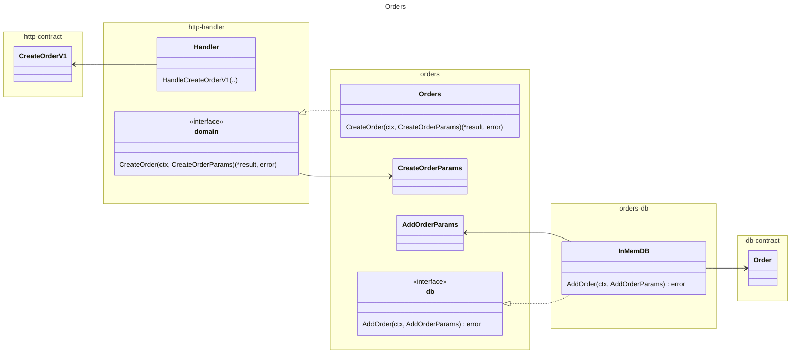

# GopherUp Tbilisi – March 2024

<!-- https://mermaid.js.org/syntax/classDiagram.html -->

```mermaid
---
title: Orders
---
classDiagram
    direction LR
    namespace http-contract {
        class CreateOrderV1 {
        }
    }
    namespace http-handler {
        class Handler {
            HandleCreateOrderV1(..)
        }

        class HTTPDomainInterface["domain"] {
            <<interface>>
            CreateOrder(ctx, CreateOrderParams)(*result, error)
        }
    }
    namespace orders {
        class Orders {
            CreateOrder(ctx, CreateOrderParams)(*result, error)
        }

        class CreateOrderParams {
        }

        class AddOrderParams {
        }
        
        class OrdersDBInterface["db"] {
            <<interface>>
            AddOrder(ctx, AddOrderParams) error
        }
    }
    namespace orders-db {
        class InMemDB {
            AddOrder(ctx, AddOrderParams) error
        }
    }
    namespace db-contract {
        class Order {
        }
    }

    CreateOrderV1 <-- Handler
    HTTPDomainInterface --> CreateOrderParams
    HTTPDomainInterface <|.. Orders
    AddOrderParams <-- InMemDB
    OrdersDBInterface <|.. InMemDB
    InMemDB --> Order
```

### References

🔗 [SOLID Go Design – by Dave Chaney](https://dave.cheney.net/2016/08/20/solid-go-design)
