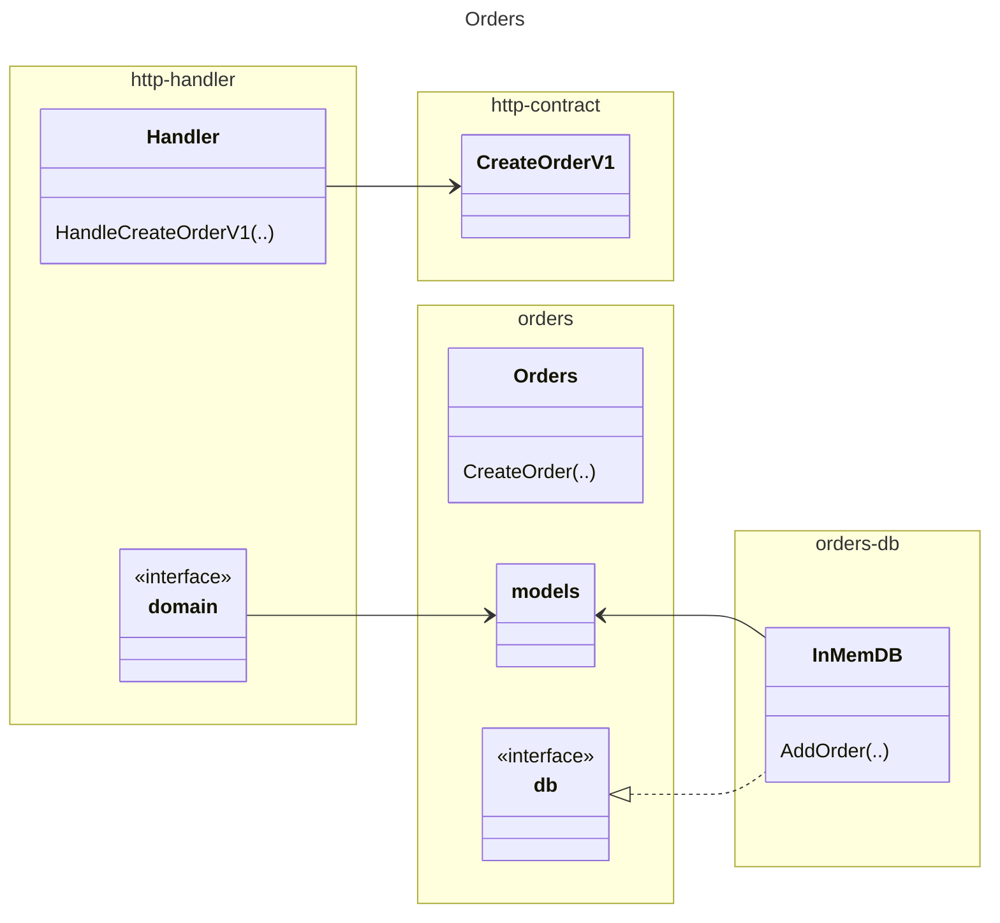

# GopherUp Tbilisi – March 2024

<!-- https://mermaid.js.org/syntax/classDiagram.html -->

```mermaid
---
title: Orders
---
classDiagram
    direction LR
    namespace http-contract {
        class CreateOrderV1 {
        }
    }
    namespace http-handler {
        class Handler {
            HandleCreateOrderV1(..)
        }
        
        class HTTPDomainInterface["domain"] {
            <<interface>>
        }
    }
    namespace orders {
        class Orders {
            CreateOrder(..)
        }
        
        class OrdersModels["models"] {
        }
        
        class OrdersDBInterface["db"] {
            <<interface>>
        }
    }
    namespace orders-db {
        class InMemDB {
            AddOrder(..)
        }
    }

    Handler --> CreateOrderV1
    HTTPDomainInterface --> OrdersModels
    OrdersModels <-- InMemDB
    OrdersDBInterface <|.. InMemDB
```
